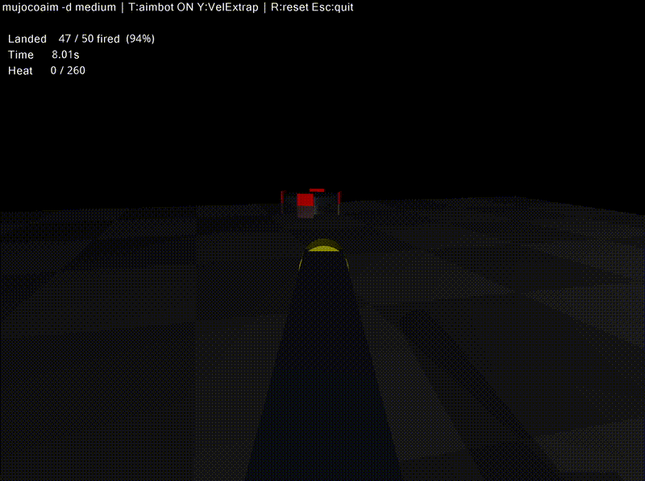
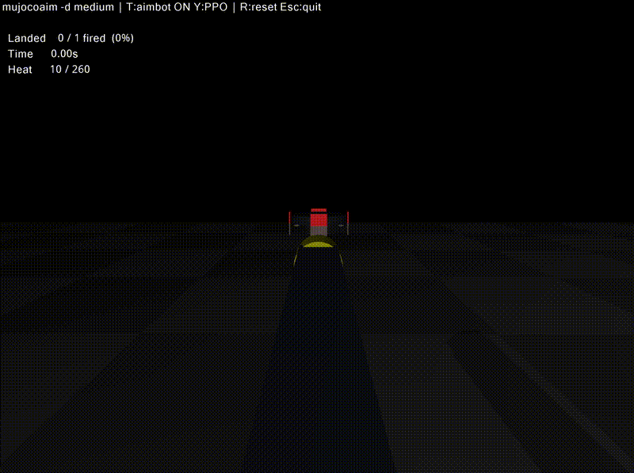

# tool_aimbot_sim — RoboMaster Gimbal Aimbot Simulation

MuJoCo + GLFW interactive simulator for developing and benchmarking
gimbal aimbot approaches against a RoboMaster-style chassis target.

## Demo

**VelExtrap** (97% accuracy):



**PPO-trained policy** (50% accuracy):



Policy trained on same target difficulty, for 500k steps. PPO implementation by Stable_baseline3.

## Quick start

```bash
# 1. Install deps (macOS, one-shot)
bash setup.sh

# 2. Run
mujocoaim -d easy          # easy target, no spin
mujocoaim -d medium        # lateral translate + spin
mujocoaim -d hard          # random waypoints + spin
```

## Build (after editing code)

```bash
cmake --build build --target mujocoaim -j$(sysctl -n hw.ncpu)
```

The XML (`gimbal.xml`) is loaded at runtime — no rebuild needed for visual tweaks.

## Controls

| Key | Action |
|-----|--------|
| `T` | Toggle aimbot on/off |
| `Y` | Cycle aiming approach: VelExtrap → Intercept+MPC → PPO |
| `G` | Cycle target difficulty: easy → medium → hard |
| `F` | Toggle gimbal POV / free camera |
| `R` | Reset (score, heat, bullets, target) |
| `Esc` | Quit |
| Mouse | Free-look (free camera) or manual aim (gimbal POV) |

## Architecture

```
tool_aimbot_sim/
├── gimbal.xml                  MuJoCo model (gimbal + target + bullets)
├── setup.sh                    One-command environment setup
├── .clangd                     LSP config (compile_commands.json + framework paths)
│
├── include/
│   ├── common/types.hpp        Vec3, wrap_pi, smoothstep
│   ├── target_models/          Swappable target difficulties (G key)
│   │   ├── target_interface.hpp   ITarget polymorphic interface
│   │   ├── target_easy.hpp        1-DOF lateral translate, no spin
│   │   ├── target_medium.hpp      Translate + spin (10.472 rad/s)
│   │   └── target_hard.hpp        Random waypoints + smoothstep + spin
│   └── aim_models/             Swappable aiming approaches (Y key)
│       ├── aim_predictor.hpp       Ballistics + velocity extrapolation + lag buffer
│       ├── aim_predictor_intercept.hpp  EKF + circular model + intercept solver + MPC
│       └── aim_predictor_ppo.hpp   ONNX Runtime inference (trained policy)
│
├── src/
│   ├── cli/main.cpp            Entry point (mujocoaim binary)
│   ├── target_models/          Target model implementations
│   └── aim_models/             Aim predictor implementations
│
├── training/
│   ├── ppo_env.py              Pure-Python Gymnasium env (replica of C++ sim)
│   └── train.py                PPO training + ONNX export
│
└── build/                      CMake build directory
```

## Aiming approaches

| Approach | Key | Method |
|----------|-----|--------|
| VelExtrap | Y→0 | Constant-velocity lead prediction + ballistic pitch |
| Intercept+MPC | Y→1 | EKF (8-D) → circular motion model → analytic intercept → MPC |
| PPO | Y→2 | Trained neural network (ONNX) — 3D action: yaw_vel, pitch_vel, fire |

## Training the PPO policy

```bash
cd training
python train.py                     # 500k steps (default)
python train.py --timesteps 1000000 # longer training
python train.py --resume            # continue from checkpoint
```

Exports `src/aim_predictor.onnx` for C++ inference. The C++ binary loads it
automatically on startup — falls back to VelExtrap if the file is missing.

## Realism knobs

| Parameter | Value | Description |
|-----------|-------|-------------|
| Detection lag | 15 ms | CV pipeline latency (capture → YOLO → PnP → EKF) |
| Shooting delay | 30 ms | Trigger solenoid → barrel exit |
| Barrel heat limit | 260 J | RMUC sentry limit (+10/shot, −30 J/s cooling) |
| Bullet speed | 24.8 m/s | 17 mm projectile |
| Armor plate | 135×125×5 mm | RMUL spec |

## Dependencies

**C++ (macOS):**
- MuJoCo 3.x framework (`/Library/Frameworks/mujoco.framework`)
- glfw3, ONNX Runtime (`brew install glfw onnxruntime`)
- CMake ≥ 3.16

**Python (training only):**
- `mujoco`, `gymnasium`, `stable-baselines3`, `torch`, `onnx`, `onnxruntime`
- Install via: `uv pip install mujoco gymnasium stable-baselines3 torch onnx onnxruntime`

## License

MIT
